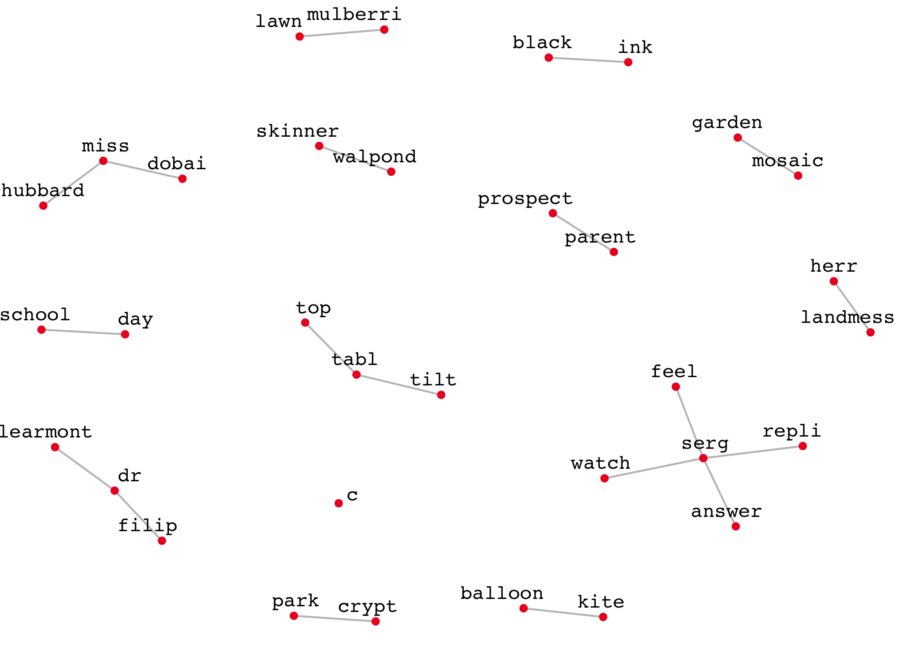
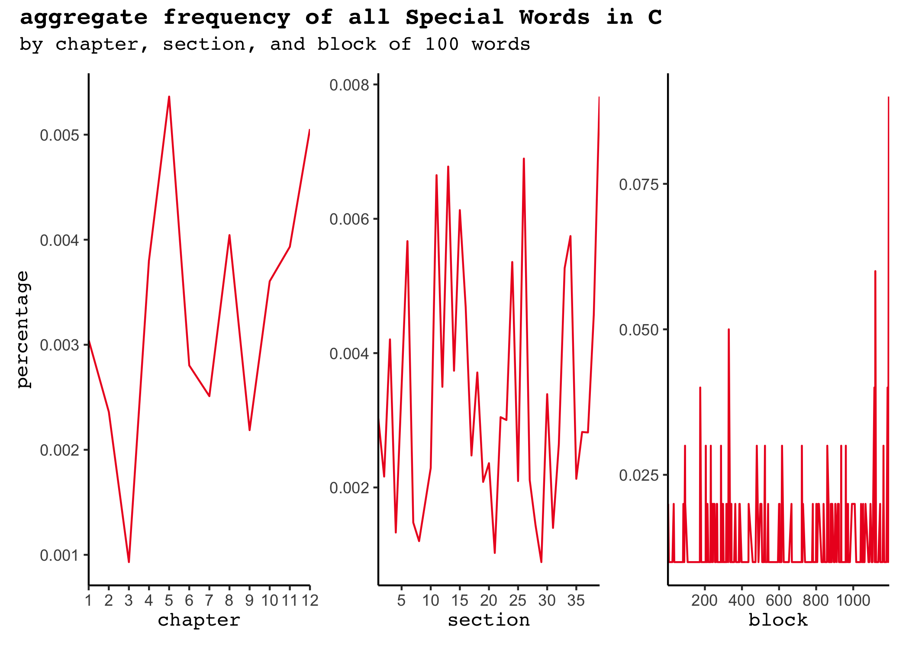
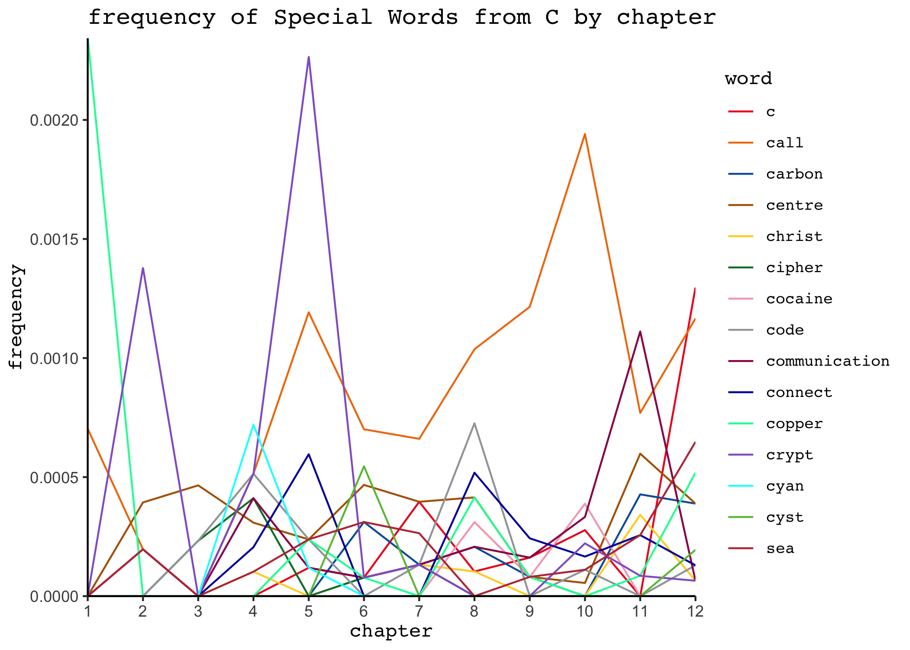

This markdown document contains the outputs I refer to in my Substack post on text mining Tom McCarthy's brilliant novel _C_, as well as the code I use to get those outputs. Text file of _C_ not included, _bien sûr_.

A significant amount of the code below is adapted from Julia Silge and David Robinson’s [_Text Mining with R: A Tidy Approach_](https://www.tidytextmining.com/). Additionally, I imagine there are better or more elegant ways of doing many of the things I do below. My general approach was to just cobble together whatever I needed to make this project work.

### Preprocessing:

``` r
library(tidyverse)

# loading text file and making it into a dataframe; some minor cleanup

# note that I toss out part headers but preserve titles of novel's parts (e.g., "Caul") as formatted in my .txt file

c_raw <- read.delim("C.txt", header = FALSE, sep = "\n")
c_raw <- c_raw[["V1"]]
c_df <- tibble(paragraph = 1:length(c_raw), text = c_raw) |>
  mutate(chapter = cumsum(str_detect(text, regex("CHAPTER",
                                                 ignore_case = FALSE))),
         .before = paragraph) |>
  mutate(section = cumsum(str_detect(text, regex("SECTION",
                                                 ignore_case = FALSE))),
         .after = chapter) |>
  mutate(text = trimws(gsub(regex("PART [0-9]+"), "", text)))

c_df <- c_df[!grepl("CHAPTER [0-9]+|SECTION [0-9]+", c_df$text), ]

# loading tidytext's stopwords list and customizing it

library(tidytext)
data(stop_words)

stop_words <- bind_rows(stop_words, tibble(word = c("beneath", "set",
                                                    "sets", "setting",
                                                    "tell", "tells",
                                                    "telling", "told"),
                                           lexicon = "custom")) |>
  filter(!word %in% c("c", "c's"))

# tokenizing and stemming words

library(SnowballC)

c_tidy_blocked <- c_df |>
  unnest_tokens(word, text)

# adding a marker every 100 words (before removing stop words) such that text can be partitioned into blocks of "uniform" length

block_length <- 100

c_tidy_blocked$block <- rep(seq(1, 1 + (nrow(c_tidy_blocked)) %/% block_length),
                            each = block_length,
                            length.out = nrow(c_tidy_blocked))
  
c_tidy <- c_tidy_blocked |>
  relocate(block, .after = section) |>
  anti_join(stop_words, by = "word") |>
  mutate(word = wordStem(word, language = "english"))
```

### Basic term frequency analysis:

Here are the ten most frequently appearing word stems in _C_:


``` r
c_tidy_sorted <- count(c_tidy, word, sort = TRUE)

c_tidy_top <- slice_max(c_tidy_sorted, n, n = 10, with_ties = FALSE)

c_tidy_top
```

```
## # A tibble: 10 × 2
##    word      n
##    <chr> <int>
##  1 serg   1129
##  2 time    265
##  3 hand    248
##  4 head    183
##  5 move    180
##  6 line    171
##  7 run     165
##  8 start   152
##  9 eye     150
## 10 word    142
```

And here are the top 10 word stems in _C_ by tf–idf, calculated within a corpus of novels:


``` r
library(gutenbergr)

# gathering public domain novels to create a corpus in which to calculate tf–idf

novels_df <- gutenberg_download(c(768, 766, 110, 42671,
                                  526, 4300, 432, 67138),
                                meta_fields = "title",
                                mirror = "http://mirror.csclub.uwaterloo.ca/gutenberg/")

novels_df <- novels_df[!(novels_df$text == ""), ]

# tokenizing and stemming words in public domain novels; not worrying about extraneous text (e.g., titles, tables of contents) because retaining them doesn't strike me as ultra-consequential in this context

novels_tidy <- novels_df |>
  unnest_tokens(word, text) |>
  mutate(word = str_extract(word, "[a-zà-ÿ0-9'’]+")) |> # getting rid of underscores used for emphasis in UTF-8 encoding
  mutate(word = gsub("’", "'", word)) |>
  anti_join(stop_words, by = "word") |>
  mutate(word = wordStem(word, language = "english")) # stemming all words for consistency with the approach I took with C

# sort words in public domain novels by frequency in each novel

novels_tidy_sorted <- count(novels_tidy, title, word, sort = TRUE)

# merging dataframes

big_dataframe <- rbind(novels_tidy_sorted, c_tidy_sorted |>
                         mutate(title = "C", .before = "word"))

# calculating tf-idf

c_top_tf_idf <- big_dataframe |>
  bind_tf_idf(word, title, n) |>
  filter(title == "C") |>
  slice_max(tf_idf, n = 10, with_ties = FALSE) |>
  select(word, tf_idf)

c_top_tf_idf
```

```
## # A tibble: 10 × 2
##    word      tf_idf
##    <chr>      <dbl>
##  1 serg     0.0255 
##  2 carrefax 0.00618
##  3 sophi    0.00420
##  4 widsun   0.00343
##  5 audrey   0.00293
##  6 learmont 0.00284
##  7 gibb     0.00239
##  8 clair    0.00204
##  9 macauley 0.00203
## 10 dobai    0.00194
```

### Bigram frequency analysis:

Here I tokenize _C_ into bigrams instead of unigrams:


``` r
# bigrams will not be sensitive to sentence or paragraph boundaries and will include titles of novel's parts; any bigram that contains a stop word will be removed

c_df_collapsed <- tibble(line = 1, text = paste(c_df$text, collapse = " ")) |>
  mutate(text = gsub("  ", " ", text))

c_bigrams_tidy <- c_df_collapsed |>
  unnest_tokens(bigram, text, token = "ngrams", n = 2) |>
  separate(bigram, c("word1", "word2"), sep = " ") |>
  filter(!word1 %in% stop_words$word) |>
  mutate(word1 = wordStem(word1, language = "english")) |>
  filter(!word2 %in% stop_words$word) |>
  mutate(word2 = wordStem(word2, language = "english")) |>
  unite(bigram, word1, word2, sep = " ")

# 20 most frequently appearing bigrams in C:

c_bigrams_tidy_sorted <- count(c_bigrams_tidy, bigram, sort = TRUE)

c_bigrams_tidy_top <- slice_max(c_bigrams_tidy_sorted, n, n =20, with_ties = FALSE)

c_bigrams_tidy_top
```

```
## # A tibble: 20 × 2
##    bigram              n
##    <chr>           <int>
##  1 miss dobai         41
##  2 dr filip           40
##  3 miss hubbard       27
##  4 crypt park         19
##  5 serg answer        16
##  6 kite balloon       15
##  7 serg repli         15
##  8 walpond skinner    15
##  9 dr learmont        14
## 10 mulberri lawn      14
## 11 day school         13
## 12 herr landmess      13
## 13 serg watch         13
## 14 c c                12
## 15 serg feel          12
## 16 tabl top           11
## 17 prospect parent    10
## 18 tabl tilt          10
## 19 mosaic garden       9
## 20 black ink           8
```

Here I check to see if the top bigrams in _C_ remain basically the same if we calculate based on tf-idf instead of simple bigram frequency:


``` r
# getting bigrams of public domain novels

novels_df_collapsed <- setNames(aggregate
                                (novels_df$text,
                                  list(novels_df$title),
                                  paste, collapse=" "),
                                c("title", "text")) |>
  mutate(text = gsub("  ", " ", text))

novels_bigrams_tidy <- novels_df_collapsed |>
  unnest_tokens(bigram, text, token = "ngrams", n = 2) |>
  separate(bigram, c("word1", "word2"), sep = " ") |>
  mutate(word1 = str_extract(word1, "[a-zà-ÿ0-9'’]+")) |>
  mutate(word1 = gsub("’", "'", word1)) |>
  filter(!word1 %in% stop_words$word) |>
  mutate(word1 = wordStem(word1, language = "english")) |>
  mutate(word2 = str_extract(word2, "[a-zà-ÿ0-9'’]+")) |>
  mutate(word1 = gsub("’", "'", word1)) |>
  filter(!word2 %in% stop_words$word) |>
  mutate(word2 = wordStem(word2, language = "english")) |>
  unite(bigram, word1, word2, sep = " ")

novels_bigrams_tidy_sorted <- count(novels_bigrams_tidy,
                                    title, bigram, sort = TRUE)
  
big_bigram_dataframe <- rbind(novels_bigrams_tidy_sorted,
                              c_bigrams_tidy_sorted |>
                         mutate(title = "C", .before = "bigram"))

c_top_bigram_tf_idf <- big_bigram_dataframe |>
  bind_tf_idf(bigram, title, n) |>
  filter(title == "C") |>
  slice_max(tf_idf, n = 20, with_ties = FALSE) |>
  select(bigram, tf_idf)

c_top_bigram_tf_idf
```

```
##             bigram      tf_idf
## 1       miss dobai 0.005276840
## 2         dr filip 0.005148136
## 3     miss hubbard 0.003474992
## 4       crypt park 0.002445365
## 5      serg answer 0.002059255
## 6     kite balloon 0.001930551
## 7       serg repli 0.001930551
## 8  walpond skinner 0.001930551
## 9      dr learmont 0.001801848
## 10   mulberri lawn 0.001801848
## 11      day school 0.001673144
## 12   herr landmess 0.001673144
## 13      serg watch 0.001673144
## 14       serg feel 0.001544441
## 15 prospect parent 0.001287034
## 16       tabl tilt 0.001287034
## 17   mosaic garden 0.001158331
## 18       black ink 0.001029627
## 19       lead serg 0.001029627
## 20    school pupil 0.001029627
```

Here's a graph of the 20 most freuqent bigrams in _C_:


``` r
# taking the bigram visualization approach described in Chapter 4 of Text Mining with R: A Tidy Approach and tweaking it a bit

library(ggraph)
set_graph_style(family = "mono", background = "white")

c_bigrams_graph <- c_bigrams_tidy_top |>
  separate(bigram, c("word1", "word2"), sep = " ")

set.seed(4)

ggraph(c_bigrams_graph, layout = "fr") +
  geom_edge_link(alpha=0.3) +
  geom_node_point(colour = "#ED1C24", alpha = 8.5) +
  geom_node_text(aes(label = name), vjust = 1, hjust = 1, repel = TRUE) +
  theme_void()
```



### Frequency analysis of specified words:

Here I look at the frequency in _C_ of the following words, based on appearances per chapter or section:


```
                                                             
 "C"      "cipher"                  "copper"                 
 "call"   "cocaine"                 "crypt/cryptography/etc."
 "carbon" "code"                    "cyan/cyanide"           
 "centre" "communication/Comintern" "cyst"                   
 "Christ" "connect"                 "sea"                    
```

First I look at the aggregate frequency of all 20 words across chapters, sections, and blocks of 100 words.


``` r
# filtering unigrams of _C_ down to only the specified words and merging tokens I count as being instances of the same word for the limited purposes of this analysis (e.g., "carbon" and "cc")

# not loving the inelegance of this whole chunk of code, and I know I can do this in a better way if I mess around with it more, but this works for now

specified_words_filtered <- c_tidy |>
  filter(chapter > 0) |>
  filter(grepl("\\bc\\b|\\bcc\\b|\\bcall\\b|^carbon|^centr|^christ|^cipher|^cocain|\\bcode\\b|^communic|^comintern|^connect|^copper|^crypt|^cyan|^cyst|\\bsea\\b", word)) |>
  filter(!word %in% c("c'est"))

specified_words_filtered_merged <- specified_words_filtered |>
  mutate(word = gsub(regex("\\bcc\\b|\\bcc'd\\b|^carbon[a-zà-ÿ]+\\b"), "carbon", word)) |>
  mutate(word = gsub(regex("^centr|centr[a-zà-ÿ]+\\b"), "centre", word)) |>
  mutate(word = gsub(regex("^christ[a-zà-ÿ]+\\b"), "christ", word)) |>
  mutate(word = gsub(regex("^cipher[a-zà-ÿ]+\\b"), "cipher", word)) |>
  mutate(word = gsub(regex("^cocain"), "cocaine", word)) |>
  mutate(word = gsub(regex("^communic\\b|comintern"), "communication", word)) |>
  mutate(word = gsub(regex("^connect[a-zà-ÿ]+\\b"), "connect", word)) |>
  mutate(word = gsub(regex("^crypt[a-zà-ÿ]+\\b"), "crypt", word)) |>
  mutate(word = gsub(regex("^cyan[a-zà-ÿ]+\\b"), "cyan", word)) |>
  mutate(word = gsub(regex("^cyst[a-zà-ÿ]+\\b"), "cyst", word))

# getting total number of words by chapter/section/block (inclusive of stopwords)

total_words_by_chapter <- c_df |>
  unnest_tokens(word, text) |>
  filter(chapter > 0) |>
  count(chapter) |>
  rename(total = n)

total_words_by_section <- c_df |>
  unnest_tokens(word, text) |>
  filter(section > 0) |>
  count(section) |>
  rename(total = n)

total_words_by_block <- c_tidy_blocked |>
  count(block) |>
  rename(total = n)

# getting number of specified words by chapter/section/block

specified_words_sorted_by_chapter <- count(specified_words_filtered_merged, chapter, word, sort = TRUE) |>
  arrange(word)

specified_words_sorted_by_section <- count(specified_words_filtered_merged, section, word, sort = TRUE) |>
  arrange(word)

specified_words_sorted_by_block <- count(specified_words_filtered_merged, block, word, sort = TRUE) |>
  arrange(word)

# calculating and plotting aggregate frequency of all 20 words by chapter/section (not particularly interesting):

aggregate_word_frequency_by_chapter <- specified_words_sorted_by_chapter |>
  group_by(chapter) |>
  summarise(n = sum(n)) |>
  left_join(total_words_by_chapter, by = "chapter") |>
  mutate(percentage = n/total)

aggregate_word_frequency_by_section <- specified_words_sorted_by_section |>
  group_by(section) |>
  summarise(n = sum(n)) |>
  left_join(total_words_by_section, by = "section") |>
  mutate(percentage = n/total)

aggregate_word_frequency_by_block <- specified_words_sorted_by_block |>
  group_by(block) |>
  summarise(n = sum(n)) |>
  left_join(total_words_by_block, by = "block") |>
  mutate(percentage = n/total)

library(patchwork)
theme_set(theme_classic())

plot1 <- ggplot(aggregate_word_frequency_by_chapter, aes(chapter, percentage)) +
  geom_line(color = "#ED1C24") +
  scale_x_continuous(limits = c(1,12), breaks = seq(0, 100), expand = c(0, 0)) +
  theme(axis.title.y = element_text(vjust = 2, family = "mono"),
        axis.title.x = element_text(family = "mono"))

plot2 <- ggplot(aggregate_word_frequency_by_section, aes(section, percentage)) +
  geom_line(color = "#ED1C24") +
  scale_x_continuous(limits = c(1,39), breaks = seq(0, 100, by = 5), expand = c(0, 0)) +
  theme(axis.title.y = element_blank(),
        axis.title.x = element_text(family = "mono"))

plot3 <- ggplot(aggregate_word_frequency_by_block, aes(block, percentage)) +
  geom_line(color = "#ED1C24") +
  scale_x_continuous(limits = c(1,1194), breaks = seq(0, 1194, by = 200), expand = c(0, 0)) +
  theme(axis.title.y = element_blank(),
        axis.title.x = element_text(family = "mono"))

plot1 + plot2 + plot3 + plot_annotation(title = "aggregate frequency of all Special Words in C", subtitle = "by chapter, section, and block of 100 words") & theme(plot.title = element_text(family = "mono", face = "bold"), plot.subtitle = element_text(family = "mono"))
```



I calculate Pearson correlation coefficients for the above data to check for any linear trend:


```
 chapter
 correlation: 0.4282063 
 p-value: 0.1649067 

 section
 correlation: 0.09153818 
 p-value: 0.5900058 

 block
 correlation: 0.1137324 
 p-value: 0.04683194
```
There's a positive correlation between frequency of specified words and the progression of the novel. If calculated based on 100-word blocks, the increase has a modest level of significance.

Now I look at the frequency of specific words across chapters/sections/blocks:


``` r
# calculating frequency of specified words across chapters/sections/blocks:

specified_word_frequency_by_chapter <- specified_words_sorted_by_chapter |>
  pivot_wider(names_from = word, values_from = n, values_fill = 0) |>
  left_join(total_words_by_chapter, by = "chapter") |>
  mutate(across(c(2:16), ~ .x/total))

specified_word_frequency_by_section <- specified_words_sorted_by_section |>
  pivot_wider(names_from = word, values_from = n, values_fill = 0) |>
  left_join(total_words_by_section, by = "section") |>
  mutate(across(c(2:16), ~ .x/total))

specified_word_frequency_by_block <- specified_words_sorted_by_block |>
  pivot_wider(names_from = word, values_from = n, values_fill = 0) |>
  left_join(total_words_by_block, by = "block") |>
  mutate(across(c(2:16), ~ .x/total))

# plotting individual frequencies of all 20 words across chapters/sections/blocks:

plot1 <- ggplot(specified_word_frequency_by_chapter, aes(chapter)) +
  geom_line(aes(y = c, colour = "c")) +
  geom_line(aes(y = call, colour = "call")) +
  geom_line(aes(y = carbon, colour = "carbon")) +
  geom_line(aes(y = centre, colour = "centre")) +
  geom_line(aes(y = christ, colour = "christ")) +
  geom_line(aes(y = cipher, colour = "cipher")) +
  geom_line(aes(y = cocaine, colour = "cocaine")) +
  geom_line(aes(y = code, colour = "code")) +
  geom_line(aes(y = communication, colour = "communication")) +
  geom_line(aes(y = connect, colour = "connect")) +
  geom_line(aes(y = copper, colour = "copper")) +
  geom_line(aes(y = crypt, colour = "crypt")) +
  geom_line(aes(y = cyan, colour = "cyan")) +
  geom_line(aes(y = cyst, colour = "cyst")) +
  geom_line(aes(y = sea, colour = "sea")) +
  scale_x_continuous(limits = c(1, 12), breaks = seq(0, 100), expand = c(0, 0)) +
  scale_y_continuous(expand = c(0, 0)) +
  scale_color_manual(values = c("#ED1C24","#EF7B10","#0060A8", "#B26300", "#FFD329", "#007D32", "#F4A9BE", "#A1A5A7", "#9B0058", "#0019A8", "#00FFA1", "#9364CC", "cyan", "#6CBE45", "#BD3844")) +
  labs(x = "chapter", y = "frequency", color="word") +
  ggtitle("frequency of Special Words from C by chapter") +
  theme(axis.title.x = element_text(family = "mono"),
        axis.title.y = element_text(family = "mono"),
        plot.title = element_text(family = "mono"),
        plot.subtitle = element_text(family = "mono"),
        legend.title = element_text(family = "mono"),
        legend.text = element_text(family = "mono"))

plot2 <- ggplot(specified_word_frequency_by_section, aes(section)) +
  geom_line(aes(y = c, colour = "c")) +
  geom_line(aes(y = call, colour = "call")) +
  geom_line(aes(y = carbon, colour = "carbon")) +
  geom_line(aes(y = centre, colour = "centre")) +
  geom_line(aes(y = christ, colour = "christ")) +
  geom_line(aes(y = cipher, colour = "cipher")) +
  geom_line(aes(y = cocaine, colour = "cocaine")) +
  geom_line(aes(y = code, colour = "code")) +
  geom_line(aes(y = communication, colour = "communication")) +
  geom_line(aes(y = connect, colour = "connect")) +
  geom_line(aes(y = copper, colour = "copper")) +
  geom_line(aes(y = crypt, colour = "crypt")) +
  geom_line(aes(y = cyan, colour = "cyan")) +
  geom_line(aes(y = cyst, colour = "cyst")) +
  geom_line(aes(y = sea, colour = "sea")) +
  scale_x_continuous(limits = c(1, 39), breaks = seq(0, 100, by = 5), expand = c(0, 0)) +
  scale_y_continuous(expand = c(0, 0)) +
  scale_color_manual(values = c("#ED1C24","#EF7B10","#0060A8", "#B26300", "#FFD329", "#007D32", "#F4A9BE", "#A1A5A7", "#9B0058", "#0019A8", "#00FFA1", "#9364CC", "cyan", "#6CBE45", "#BD3844")) +
  labs(x = "section", y = "frequency", color="word") +
  ggtitle("frequency of Special Words from C by section") +
  theme(axis.title.x = element_text(family = "mono"),
        axis.title.y = element_text(family = "mono"),
        plot.title = element_text(family = "mono"),
        plot.subtitle = element_text(family = "mono"),
        legend.title = element_text(family = "mono"),
        legend.text = element_text(family = "mono"))

plot3 <- ggplot(specified_word_frequency_by_block, aes(block)) +
  geom_line(aes(y = c, colour = "c")) +
  geom_line(aes(y = call, colour = "call")) +
  geom_line(aes(y = carbon, colour = "carbon")) +
  geom_line(aes(y = centre, colour = "centre")) +
  geom_line(aes(y = christ, colour = "christ")) +
  geom_line(aes(y = cipher, colour = "cipher")) +
  geom_line(aes(y = cocaine, colour = "cocaine")) +
  geom_line(aes(y = code, colour = "code")) +
  geom_line(aes(y = communication, colour = "communication")) +
  geom_line(aes(y = connect, colour = "connect")) +
  geom_line(aes(y = copper, colour = "copper")) +
  geom_line(aes(y = crypt, colour = "crypt")) +
  geom_line(aes(y = cyan, colour = "cyan")) +
  geom_line(aes(y = cyst, colour = "cyst")) +
  geom_line(aes(y = sea, colour = "sea")) +
  scale_x_continuous(limits = c(1, 1194), breaks = seq(0, 1194, by = 100), expand = c(0, 0)) +
  scale_y_continuous(expand = c(0, 0)) +
  scale_color_manual(values = c("#ED1C24","#EF7B10","#0060A8", "#B26300", "#FFD329", "#007D32", "#F4A9BE", "#A1A5A7", "#9B0058", "#0019A8", "#00FFA1", "#9364CC", "cyan", "#6CBE45", "#BD3844")) +
  labs(x = "block", y = "frequency", color="word") +
  ggtitle("frequency of Special Words from C by block of 100 words") +
  theme(axis.title.x = element_text(family = "mono"),
        axis.title.y = element_text(family = "mono"),
        plot.title = element_text(family = "mono"),
        plot.subtitle = element_text(family = "mono"),
        legend.title = element_text(family = "mono"),
        legend.text = element_text(family = "mono"))

plot1
```



Here too, I calculate Pearson correlation coefficients for the above data to check for linear trends:


```
                        chapter (cor)  (p-value) section (cor)  (p-value)
C                          0.59430914 0.04156302   0.372257782 0.02327622
call                       0.65638226 0.02043243   0.262603905 0.11636095
carbon                     0.68696457 0.01358749   0.183639602 0.27660310
centre                     0.17404367 0.58852329   0.008183258 0.96166118
Christ                     0.46010316 0.13230753   0.186610673 0.26877068
cipher                    -0.35194219 0.26190322  -0.197370968 0.24163243
cocaine                    0.37609472 0.22824323   0.174002157 0.30302414
code                      -0.02203525 0.94580773  -0.106876018 0.52895915
communication/Comintern    0.43158429 0.16123557   0.204511029 0.22467959
connect                    0.29831599 0.34628679   0.124195826 0.46394437
copper                    -0.35094058 0.26335796  -0.336889128 0.04145846
crypt/cryptography/etc.   -0.33285542 0.29042639  -0.222174074 0.18628932
cyan/cyanide              -0.24036615 0.45173685  -0.146899314 0.38561052
cyst                       0.12383162 0.70140343  -0.012729301 0.94039399
sea                        0.52000123 0.08309977   0.252453438 0.13169644
                         block (cor)    (p-value)
C                        0.148998259 9.045638e-03
call                     0.160466840 4.896097e-03
carbon                   0.087724412 1.257142e-01
centre                  -0.016587834 7.725807e-01
Christ                   0.057795275 3.135941e-01
cipher                  -0.172314273 2.489722e-03
cocaine                  0.063187843 2.704993e-01
code                    -0.101499067 7.625805e-02
communication/Comintern  0.099546681 8.211400e-02
connect                 -0.007695203 8.933534e-01
copper                  -0.077859389 1.743140e-01
crypt/cryptography/etc. -0.252886045 7.513388e-06
cyan/cyanide            -0.171244374 2.651229e-03
cyst                    -0.009865364 8.635387e-01
sea                      0.114460260 4.543315e-02
```

### Pairwise correlation analysis of specified words:

Finally, I look at which of the 15 words beginning with _C_ specified above are most likely to occur in the same chapter/section of _C_:


``` r
library(widyr)

word_pairs_by_chapter <- specified_words_filtered_merged |>
  select(chapter, word) |>
  group_by(word) |>
  pairwise_cor(word, chapter, sort = TRUE)

word_pairs_by_section <- specified_words_filtered_merged |>
  select(section, word) |>
  group_by(word) |>
  pairwise_cor(word, section, sort = TRUE)

word_pairs_by_block <- specified_words_filtered_merged |>
  select(block, word) |>
  group_by(word) |>
  pairwise_cor(word, block, sort = TRUE)

top_word_pairs_by_section <- word_pairs_by_section |>
  filter(correlation > .3)
```

Here are the 10 specified words most correlated with "c" by chapter:


``` r
word_pairs_by_chapter |>
  filter(item1 == "c") |>
  slice_max(correlation, n = 10, with_ties = FALSE)
```

```
## # A tibble: 10 × 3
##    item1 item2         correlation
##    <chr> <chr>               <dbl>
##  1 c     communication       0.529
##  2 c     carbon              0.507
##  3 c     cocaine             0.488
##  4 c     cyst                0.378
##  5 c     call                0.357
##  6 c     centre              0.357
##  7 c     copper              0.314
##  8 c     code                0.314
##  9 c     connect             0.314
## 10 c     sea                 0.293
```

Here are the 10 specified words most correlated with "call" by chapter:


``` r
word_pairs_by_chapter |>
  filter(item1 == "call") |>
  slice_max(correlation, n = 10, with_ties = FALSE)
```

```
## # A tibble: 10 × 3
##    item1 item2         correlation
##    <chr> <chr>               <dbl>
##  1 call  communication       0.674
##  2 call  sea                 0.522
##  3 call  crypt               0.426
##  4 call  copper              0.357
##  5 call  connect             0.357
##  6 call  c                   0.357
##  7 call  christ              0.302
##  8 call  carbon              0.302
##  9 call  cocaine             0.174
## 10 call  cyan                0.135
```

And here's a visualization of every pair of those specified words that has a greater than 0 correlation within chapters/blocks of _C_:


``` r
set.seed(44)

plot1 <- word_pairs_by_chapter |>
  filter(correlation > 0) |>
  ggraph(layout = "fr") +
  geom_edge_link(aes(edge_alpha = correlation), show.legend = FALSE) +
  geom_node_point(color = "#ED1C24", size = 2.5, alpha = 0.85) +
  geom_node_text(aes(label = name), repel = TRUE) +
  theme_void()

plot2 <- word_pairs_by_section |>
  filter(correlation > 0) |>
  ggraph(layout = "fr") +
  geom_edge_link(aes(edge_alpha = correlation), show.legend = FALSE) +
  geom_node_point(color = "#ED1C24", size = 2.5, alpha = 0.85) +
  geom_node_text(aes(label = name), repel = TRUE) +
  theme_void()

plot3 <- word_pairs_by_block |>
  filter(correlation > 0) |>
  ggraph(layout = "fr") +
  geom_edge_link(aes(edge_alpha = correlation), show.legend = FALSE) +
  geom_node_point(color = "#ED1C24", size = 2.5, alpha = 0.85) +
  geom_node_text(aes(label = name), repel = TRUE) +
  theme_void()

plot1 + plot3
```


