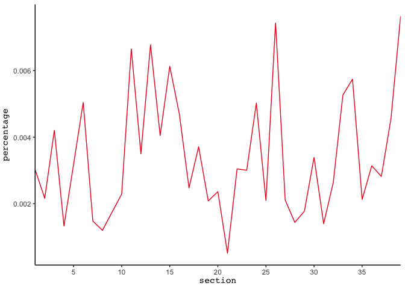
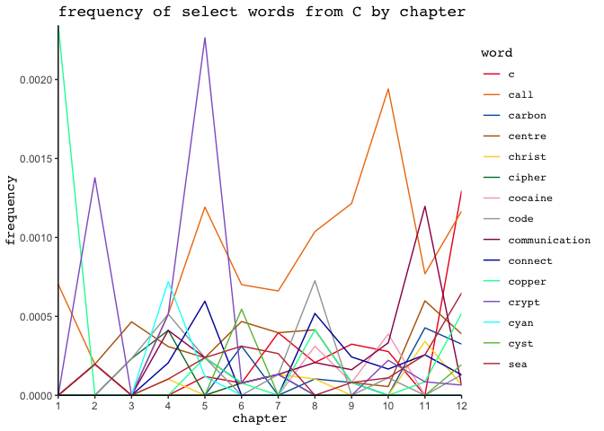
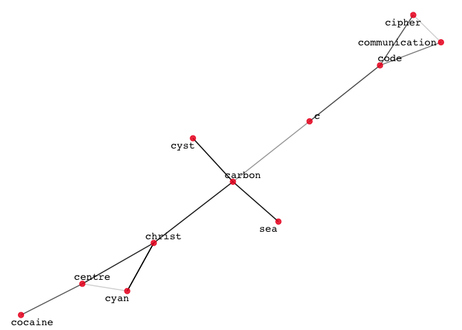

Text Mining *C* (v1)
================

This markdown document contains the outputs I refer to in my Substack
post on text mining Tom McCarthy’s brilliant novel *C*, as well as the
code I use to get those outputs. Text file of *C* not included, *bien
sûr*.

A significant amount of the code below is adapted from Julia Silge and
David Robinson’s [*Text Mining with R: A Tidy
Approach*](https://www.tidytextmining.com/). Additionally, I imagine
there are better or more elegant ways of doing many of the things I do
below. My general approach was to just cobble together whatever I needed
to make this project work.

### Preprocessing:

``` r
library(tidyverse)

# loading text file and making it into a dataframe; some minor cleanup

# note that I toss out part headers but preserve titles of novel's parts (e.g., "Caul") as formatted in my .txt file

c_raw <- read.delim("C.txt", header = FALSE, sep = "\n")
c_raw <- c_raw[["V1"]]
c_df <- tibble(paragraph = 1:length(c_raw), text = c_raw) |>
  mutate(chapter = cumsum(str_detect(text, regex("CHAPTER",
                                                 ignore_case = FALSE)))) |>
  mutate(section = cumsum(str_detect(text, regex("SECTION",
                                                 ignore_case = FALSE)))) |>
  mutate(text = trimws(gsub(regex("PART [0-9]+"), "", text)))

c_df <- c_df[!grepl("CHAPTER [0-9]+|SECTION [0-9]+", c_df$text), ]

# loading tidytext's stopwords list and customizing it

library(tidytext)
data(stop_words)

stop_words <- bind_rows(stop_words, tibble(word = c("beneath", "set",
                                                    "sets", "setting",
                                                    "tell", "tells",
                                                    "telling", "told"),
                                           lexicon = "custom")) |>
  filter(!word %in% c("c", "c's"))

# tokenizing and stemming words

library(SnowballC)

c_tidy_blocked <- c_df |>
  unnest_tokens(word, text)

# adding a marker every 100 words (before removing stop words) such that text can be partitioned into blocks of "uniform" length

block_length <- 100

c_tidy_blocked$block <- rep(seq(1, 1 + (nrow(c_tidy_blocked)) %/% block_length),
                            each = block_length,
                            length.out = nrow(c_tidy_blocked))
  
c_tidy <- c_tidy_blocked |>
  mutate(word = gsub("'s\\b", "", word)) |> # wordStem doesn't remove the apostrophe in the English possessive "'s"
  anti_join(stop_words, by = "word") |>
  mutate(word = wordStem(word), language = "english")
```

### Basic term frequency analysis:

Here are the ten most frequently appearing word stems in *C*:

``` r
c_tidy_sorted <- count(c_tidy, word, sort = TRUE)

c_tidy_top <- slice_max(c_tidy_sorted, n, n = 10)

c_tidy_top
```

    ## # A tibble: 10 × 2
    ##    word      n
    ##    <chr> <int>
    ##  1 serg   1129
    ##  2 time    265
    ##  3 hand    248
    ##  4 head    183
    ##  5 move    180
    ##  6 line    171
    ##  7 run     165
    ##  8 start   152
    ##  9 ey      146
    ## 10 word    142

And here are the top 10 word stems in *C* by
tfknitr::asis_output(&ndash)idf, calculated within a corpus of novels:

``` r
library(gutenbergr)

# gathering public domain novels to create a corpus in which to calculate tf&ndashidf

novels_df <- gutenberg_download(c(768, 766, 110, 42671, 526, 4300, 432, 67138), meta_fields = "title", mirror = "http://mirror.csclub.uwaterloo.ca/gutenberg/")

novels_df <- novels_df[!(novels_df$text == ""), ]

# tokenizing and stemming words in public domain novels; not worrying about extraneous text (e.g., titles, tables of contents) because it doesn't really matter in this context

novels_tidy <- novels_df |>
  unnest_tokens(word, text) |>
  mutate(word = str_extract(word, "[a-z0-9']+")) |> # getting rid of underscores used for emphasis in UTF-8 encoding
  mutate(word = gsub("'s\\b", "", word)) |>
  anti_join(stop_words) |>
  mutate(word = wordStem(word))
```

    ## Joining with `by = join_by(word)`

``` r
# sort words in public domain novels by frequency in each novel

novels_tidy_sorted <- count(novels_tidy, title, word, sort = TRUE)

# merging dataframes

big_dataframe <- rbind(novels_tidy_sorted, c_tidy_sorted |>
                         mutate(title = "C", .before = "word"))

# calculating tf-idf

c_top_tf_idf <- big_dataframe |>
  bind_tf_idf(word, title, n) |>
  filter(title == "C") |>
  slice_max(tf_idf, n = 10) |>
  select(word, tf_idf)

c_top_tf_idf
```

    ## # A tibble: 10 × 2
    ##    word      tf_idf
    ##    <chr>      <dbl>
    ##  1 serg     0.0255 
    ##  2 carrefax 0.00619
    ##  3 sophi    0.00421
    ##  4 widsun   0.00344
    ##  5 audrei   0.00294
    ##  6 learmont 0.00285
    ##  7 gibb     0.00240
    ##  8 clair    0.00204
    ##  9 macaulei 0.00203
    ## 10 dobai    0.00194

### Bigram frequency analysis:

Here I tokenize *C* into bigrams instead of unigrams:

``` r
# bigrams will not be sensitive to sentence or paragraph boundaries and will include titles of novel's parts; any bigram that contains a stop word will be removed

c_df_collapsed <- tibble(line = 1, text = paste(c_df$text, collapse = " "))
c_bigrams_tidy <- c_df_collapsed |>
  unnest_tokens(bigram, text, token = "ngrams", n = 2) |>
  separate(bigram, c("word1", "word2"), sep = " ") |>
  mutate(word1 = gsub("'s\\b", "", word1)) |>
  filter(!word1 %in% stop_words$word) |>
  mutate(word1 = wordStem(word1)) |>
  mutate(word2 = gsub("'s\\b", "", word2)) |>
  filter(!word2 %in% stop_words$word) |>
  mutate(word2 = wordStem(word2)) |>
  unite(bigram, word1, word2, sep = " ")

# 20 most frequently appearing bigrams in C:

c_bigrams_tidy_sorted <- count(c_bigrams_tidy, bigram, sort = TRUE)

c_bigrams_tidy_top <- slice_max(c_bigrams_tidy_sorted, n, n =20, with_ties = FALSE)

c_bigrams_tidy_top
```

    ## # A tibble: 20 × 2
    ##    bigram              n
    ##    <chr>           <int>
    ##  1 miss dobai         41
    ##  2 dr filip           40
    ##  3 miss hubbard       27
    ##  4 crypt park         19
    ##  5 serg answer        16
    ##  6 kite balloon       15
    ##  7 serg repli         15
    ##  8 walpond skinner    15
    ##  9 dr learmont        14
    ## 10 mulberri lawn      14
    ## 11 dai school         13
    ## 12 herr landmess      13
    ## 13 serg watch         13
    ## 14 c c                12
    ## 15 serg feel          12
    ## 16 tabl top           11
    ## 17 prospect parent    10
    ## 18 tabl tilt          10
    ## 19 mosaic garden       9
    ## 20 black ink           8

Here I check to see if the top bigrams in *C* remain basically the same
if we calculate based on tf-idf instead of simple bigram frequency:

``` r
# getting bigrams of public domain novels

novels_df_collapsed <- aggregate(novels_df$text, list(novels_df$title), paste, collapse=" ")
novels_bigrams_tidy <- novels_df_collapsed |>
  unnest_tokens(bigram, x, token = "ngrams", n = 2) |>
  separate(bigram, c("word1", "word2"), sep = " ") |>
  mutate(word1 = str_extract(word1, "[a-z0-9']+")) |>
  mutate(word1 = gsub("'s\\b", "", word1)) |>
  filter(!word1 %in% stop_words$word) |>
  mutate(word1 = wordStem(word1)) |>
  mutate(word2 = str_extract(word2, "[a-z0-9']+")) |>
  mutate(word2 = gsub("'s\\b", "", word2)) |>
  filter(!word2 %in% stop_words$word) |>
  mutate(word2 = wordStem(word2)) |>
  unite(bigram, word1, word2, sep = " ")

novels_bigrams_tidy_sorted <- count(novels_bigrams_tidy, Group.1, bigram, sort = TRUE)
  
big_bigram_dataframe <- rbind(novels_bigrams_tidy_sorted, c_bigrams_tidy_sorted |>
                         mutate(Group.1 = "C", .before = "bigram"))

c_top_bigram_tf_idf <- big_bigram_dataframe |>
  bind_tf_idf(bigram, Group.1, n) |>
  filter(Group.1 == "C") |>
  slice_max(tf_idf, n = 20, with_ties = FALSE) |>
  select(bigram, tf_idf)

c_top_bigram_tf_idf
```

    ##             bigram      tf_idf
    ## 1       miss dobai 0.005307306
    ## 2         dr filip 0.005177859
    ## 3     miss hubbard 0.003495055
    ## 4       crypt park 0.002459483
    ## 5      serg answer 0.002071144
    ## 6     kite balloon 0.001941697
    ## 7       serg repli 0.001941697
    ## 8  walpond skinner 0.001941697
    ## 9      dr learmont 0.001812251
    ## 10   mulberri lawn 0.001812251
    ## 11      dai school 0.001682804
    ## 12   herr landmess 0.001682804
    ## 13      serg watch 0.001682804
    ## 14       serg feel 0.001553358
    ## 15 prospect parent 0.001294465
    ## 16       tabl tilt 0.001294465
    ## 17   mosaic garden 0.001165018
    ## 18       black ink 0.001035572
    ## 19       lead serg 0.001035572
    ## 20    school pupil 0.001035572

Here’s a graph of the 20 most freuqent bigrams in *C*:

``` r
# taking the bigram visualization approach described in Chapter 4 of Text Mining with R: A Tidy Approach and tweaking it a bit

library(ggraph)
set_graph_style(family = "mono", background = "white")

c_bigrams_graph <- c_bigrams_tidy_top |>
  separate(bigram, c("word1", "word2"), sep = " ")

set.seed(4)

ggraph(c_bigrams_graph, layout = "nicely") +
  geom_edge_link(alpha=0.3) +
  geom_node_point(colour = "#ED1C24") +
  geom_node_text(aes(label = name), vjust = 1, hjust = 1, repel = TRUE) +
  theme_void()
```

<!-- -->

### Frequency analysis of specified words:

Here I look at the frequency in *C* of the following words, based on
appearances per chapter or section:

    ## 
    ## | C      | Christ                   | copper                  |
    ## | call   | cipher                   | crypt/cryptography/etc. |
    ## | carbon | cocaine                  | cyan/cyanide            |
    ## | centre | communication/Comintern  | cyst                    |
    ## | code   | connect                  | sea                     |

First I look at the aggregate frequency of all 20 words across chapters
and sections (not particularly interesting).

``` r
# filtering unigrams of _C_ down to only the specified words

specified_words_filtered <- c_tidy |>
  filter(chapter > 0) |>
  filter(grepl("\\bc\\b|\\bcall\\b|^carbon|^centr|^christ|^cipher|^cocain|\\bcode\\b|^codew|^commun|^comintern|^connect|^copper|^crypt|^cyan|^cyst|\\bsea\\b", word)) |>
  filter(!word %in% c("c'est", "communion"))

specified_words_filtered_merged <- specified_words_filtered |>
  mutate(word = gsub(regex("^carbon[a-zà-ú]+\\b"), "carbon", word)) |>
  mutate(word = gsub(regex("^centr|centr[a-z]+\\b"), "centre", word)) |>
  mutate(word = gsub(regex("^christ[a-z]+\\b"), "christ", word)) |>
  mutate(word = gsub(regex("^cipher[a-z]+\\b"), "cipher", word)) |>
  mutate(word = gsub(regex("cocain"), "cocaine", word)) |>
  mutate(word = gsub(regex("^code[a-z]+\\b"), "code", word)) |>
  mutate(word = gsub(regex("^commun|commun[a-z]+\\b|comintern"), "communication", word)) |>
  mutate(word = gsub(regex("^connect[a-z]+\\b"), "connect", word)) |>
  mutate(word = gsub(regex("^copper[a-z]+\\b"), "copper", word)) |>
  mutate(word = gsub(regex("^crypt[a-z]+\\b"), "crypt", word)) |>
  mutate(word = gsub(regex("^cyan[a-z]+\\b"), "cyan", word)) |>
  mutate(word = gsub(regex("^cyst[a-z]+\\b"), "cyst", word)) |>
  mutate(word = gsub(regex("^sea[a-z]+\\b"), "sea", word))

# getting total number of words by chapter/section (inclusive of stopwords)

total_words_by_chapter <- c_df |>
  unnest_tokens(word, text) |>
  filter(chapter > 0) |>
  count(chapter) |>
  rename(total = n)

total_words_by_section <- c_df |>
  unnest_tokens(word, text) |>
  filter(section > 0) |>
  count(section) |>
  rename(total = n)

total_words_by_block <- c_tidy_blocked |>
  count(block) |>
  rename(total = n)

# getting number of specified words by chapter/section

specified_words_sorted_by_chapter <- specified_words_filtered_merged |>
  select(chapter, word) |>
  count(chapter, word, sort = TRUE)

specified_words_sorted_by_section <- specified_words_filtered_merged |>
  select(section, word) |>
  count(section, word, sort = TRUE)

specified_words_sorted_by_block <- specified_words_filtered_merged |>
  select(block, word) |>
  count(block, word, sort = TRUE)

# calculating and plotting aggregate frequency of all 20 words by chapter/section (not particularly interesting):

aggregate_word_frequency_by_chapter <- specified_words_sorted_by_chapter |>
  group_by(chapter) |>
  summarise(n = sum(n)) |>
  left_join(total_words_by_chapter, by = "chapter") |>
  mutate (percentage = n/total)

aggregate_word_frequency_by_section <- specified_words_sorted_by_section |>
  group_by(section) |>
  summarise(n = sum(n)) |>
  left_join(total_words_by_section, by = "section") |>
  mutate (percentage = n/total)

aggregate_word_frequency_by_block <- specified_words_sorted_by_block |>
  group_by(block) |>
  summarise(n = sum(n)) |>
  left_join(total_words_by_block, by = "block") |>
  mutate (percentage = n/total)

library(patchwork)
theme_set(theme_classic())

plot1 <- ggplot(aggregate_word_frequency_by_chapter, aes(chapter, percentage)) +
  geom_line(color = "#ED1C24") +
  scale_x_continuous(limits = c(1,12), breaks = seq(0, 100), expand = c(0, 0)) +
  theme(axis.title.y = element_text(vjust = 2, family = "mono"),
        axis.title.x = element_text(family = "mono"))

plot2 <- ggplot(aggregate_word_frequency_by_section, aes(section, percentage)) +
  geom_line(color = "#ED1C24") +
  scale_x_continuous(limits = c(1,39), breaks = seq(0, 100, by = 5), expand = c(0, 0)) +
  theme(axis.title.y = element_text(vjust = 2, family = "mono"),
        axis.title.x = element_text(family = "mono"))

plot3 <- ggplot(aggregate_word_frequency_by_block, aes(block, percentage)) +
  geom_line(color = "#ED1C24") +
  scale_x_continuous(limits = c(1,1194), breaks = seq(0, 1194, by = 100), expand = c(0, 0)) +
  theme(axis.title.y = element_text(vjust = 2, family = "mono"),
        axis.title.x = element_text(family = "mono"))

plot2
```

<!-- -->

Now I look at the frequency of specific words across
chapters/sections/blocks:

``` r
# calculating frequency of specified words across chapters/sections/blocks:

specified_word_frequency_by_chapter <- specified_words_sorted_by_chapter |>
  pivot_wider(names_from = word, values_from = n, values_fill = 0) |>
  left_join(total_words_by_chapter, by = "chapter") |>
  mutate(across(c(2:16), ~ .x/total))

specified_word_frequency_by_section <- specified_words_sorted_by_section |>
  pivot_wider(names_from = word, values_from = n, values_fill = 0) |>
  left_join(total_words_by_section, by = "section") |>
  mutate(across(c(2:16), ~ .x/total))

specified_word_frequency_by_block <- specified_words_sorted_by_block |>
  pivot_wider(names_from = word, values_from = n, values_fill = 0) |>
  left_join(total_words_by_block, by = "block") |>
  mutate(across(c(2:16), ~ .x/total))

# plotting individual frequencies of all 20 words across chapters/sections

plot1 <- ggplot(specified_word_frequency_by_chapter, aes(chapter)) +
  geom_line(aes(y = c, colour = "c")) +
  geom_line(aes(y = call, colour = "call")) +
  geom_line(aes(y = carbon, colour = "carbon")) +
  geom_line(aes(y = centre, colour = "centre")) +
  geom_line(aes(y = christ, colour = "christ")) +
  geom_line(aes(y = cipher, colour = "cipher")) +
  geom_line(aes(y = cocaine, colour = "cocaine")) +
  geom_line(aes(y = code, colour = "code")) +
  geom_line(aes(y = communication, colour = "communication")) +
  geom_line(aes(y = connect, colour = "connect")) +
  geom_line(aes(y = copper, colour = "copper")) +
  geom_line(aes(y = crypt, colour = "crypt")) +
  geom_line(aes(y = cyan, colour = "cyan")) +
  geom_line(aes(y = cyst, colour = "cyst")) +
  geom_line(aes(y = sea, colour = "sea")) +
  scale_x_continuous(limits = c(1, 12), breaks = seq(0, 100), expand = c(0, 0)) +
  scale_y_continuous(expand = c(0, 0)) +
  scale_color_manual(values = c("#ED1C24","#EF7B10","#0060A8", "#B26300", "#FFD329", "#007D32", "#F4A9BE", "#A1A5A7", "#9B0058", "#0019A8", "#00FFA1", "#9364CC", "cyan", "#6CBE45", "#BD3844")) +
  labs(x = "chapter", y = "frequency", color="word") +
  ggtitle("frequency of select words from C by chapter") +
  theme(axis.title.x = element_text(family = "mono"),
        axis.title.y = element_text(family = "mono"),
        plot.title = element_text(family = "mono"),
        plot.subtitle = element_text(family = "mono"),
        legend.title = element_text(family = "mono"),
        legend.text = element_text(family = "mono"))

plot2 <- ggplot(specified_word_frequency_by_section, aes(section)) +
  geom_line(aes(y = c, colour = "c")) +
  geom_line(aes(y = call, colour = "call")) +
  geom_line(aes(y = carbon, colour = "carbon")) +
  geom_line(aes(y = centre, colour = "centre")) +
  geom_line(aes(y = christ, colour = "christ")) +
  geom_line(aes(y = cipher, colour = "cipher")) +
  geom_line(aes(y = cocaine, colour = "cocaine")) +
  geom_line(aes(y = code, colour = "code")) +
  geom_line(aes(y = communication, colour = "communication")) +
  geom_line(aes(y = connect, colour = "connect")) +
  geom_line(aes(y = copper, colour = "copper")) +
  geom_line(aes(y = crypt, colour = "crypt")) +
  geom_line(aes(y = cyan, colour = "cyan")) +
  geom_line(aes(y = cyst, colour = "cyst")) +
  geom_line(aes(y = sea, colour = "sea")) +
  scale_x_continuous(limits = c(1, 39), breaks = seq(0, 100, by = 5), expand = c(0, 0)) +
  scale_y_continuous(expand = c(0, 0)) +
  scale_color_manual(values = c("#ED1C24","#EF7B10","#0060A8", "#B26300", "#FFD329", "#007D32", "#F4A9BE", "#A1A5A7", "#9B0058", "#0019A8", "#00FFA1", "#9364CC", "cyan", "#6CBE45", "#BD3844")) +
  labs(x = "section", y = "frequency", color="word") +
  ggtitle("frequency of select words from C by section") +
  theme(axis.title.x = element_text(family = "mono"),
        axis.title.y = element_text(family = "mono"),
        plot.title = element_text(family = "mono"),
        plot.subtitle = element_text(family = "mono"),
        legend.title = element_text(family = "mono"),
        legend.text = element_text(family = "mono"))

plot3 <- ggplot(specified_word_frequency_by_block, aes(block)) +
  geom_line(aes(y = c, colour = "c")) +
  geom_line(aes(y = call, colour = "call")) +
  geom_line(aes(y = carbon, colour = "carbon")) +
  geom_line(aes(y = centre, colour = "centre")) +
  geom_line(aes(y = christ, colour = "christ")) +
  geom_line(aes(y = cipher, colour = "cipher")) +
  geom_line(aes(y = cocaine, colour = "cocaine")) +
  geom_line(aes(y = code, colour = "code")) +
  geom_line(aes(y = communication, colour = "communication")) +
  geom_line(aes(y = connect, colour = "connect")) +
  geom_line(aes(y = copper, colour = "copper")) +
  geom_line(aes(y = crypt, colour = "crypt")) +
  geom_line(aes(y = cyan, colour = "cyan")) +
  geom_line(aes(y = cyst, colour = "cyst")) +
  geom_line(aes(y = sea, colour = "sea")) +
  scale_x_continuous(limits = c(1, 1194), breaks = seq(0, 1194, by = 100), expand = c(0, 0)) +
  scale_y_continuous(expand = c(0, 0)) +
  scale_color_manual(values = c("#ED1C24","#EF7B10","#0060A8", "#B26300", "#FFD329", "#007D32", "#F4A9BE", "#A1A5A7", "#9B0058", "#0019A8", "#00FFA1", "#9364CC", "cyan", "#6CBE45", "#BD3844")) +
  labs(x = "block", y = "frequency", color="word") +
  ggtitle("frequency of select words from C by block of 100 words") +
  theme(axis.title.x = element_text(family = "mono"),
        axis.title.y = element_text(family = "mono"),
        plot.title = element_text(family = "mono"),
        plot.subtitle = element_text(family = "mono"),
        legend.title = element_text(family = "mono"),
        legend.text = element_text(family = "mono"))

plot1
```

<!-- -->

### Correlation analysis of specified words:

Finally, I look at which of the 15 words beginning with *C* specified
above are most likely to occur in the same chapter/section of *C*:

``` r
library(widyr)

word_pairs_by_chapter <- specified_words_filtered_merged |>
  select(chapter, word) |>
  group_by(word) |>
  pairwise_cor(word, chapter, sort = TRUE)

word_pairs_by_section <- specified_words_filtered_merged |>
  select(section, word) |>
  group_by(word) |>
  pairwise_cor(word, section, sort = TRUE)

word_pairs_by_block <- specified_words_filtered_merged |>
  select(block, word) |>
  group_by(word) |>
  pairwise_cor(word, block, sort = TRUE)

top_word_pairs_by_section <- word_pairs_by_section |>
  filter(correlation > .3)

top_word_pairs_by_section
```

    ## # A tibble: 16 × 3
    ##    item1         item2         correlation
    ##    <chr>         <chr>               <dbl>
    ##  1 cocaine       c                   0.488
    ##  2 c             cocaine             0.488
    ##  3 communication call                0.399
    ##  4 call          communication       0.399
    ##  5 cyan          crypt               0.368
    ##  6 crypt         cyan                0.368
    ##  7 carbon        connect             0.367
    ##  8 connect       carbon              0.367
    ##  9 cyst          sea                 0.318
    ## 10 sea           cyst                0.318
    ## 11 c             connect             0.317
    ## 12 connect       c                   0.317
    ## 13 crypt         communication       0.306
    ## 14 communication crypt               0.306
    ## 15 carbon        sea                 0.304
    ## 16 sea           carbon              0.304

And here’s a visualization of every pair of those specified words that
has a greater than 0.2 correlation within sections of *C*:

``` r
set.seed(44)

plot1 <- word_pairs_by_chapter |>
  filter(correlation > 0) |>
  ggraph(layout = "fr") +
  geom_edge_link(aes(edge_alpha = correlation), show.legend = FALSE) +
  geom_node_point(color = "#ED1C24", size = 2.5, alpha = 0.85) +
  geom_node_text(aes(label = name), repel = TRUE) +
  theme_void()

plot2 <- word_pairs_by_section |>
  filter(correlation > 0) |>
  ggraph(layout = "fr") +
  geom_edge_link(aes(edge_alpha = correlation), show.legend = FALSE) +
  geom_node_point(color = "#ED1C24", size = 2.5, alpha = 0.85) +
  geom_node_text(aes(label = name), repel = TRUE) +
  theme_void()

plot3 <- word_pairs_by_block |>
  filter(correlation > 0) |>
  ggraph(layout = "fr") +
  geom_edge_link(aes(edge_alpha = correlation), show.legend = FALSE) +
  geom_node_point(color = "#ED1C24", size = 2.5, alpha = 0.85) +
  geom_node_text(aes(label = name), repel = TRUE) +
  theme_void()

plot3
```

<!-- -->
